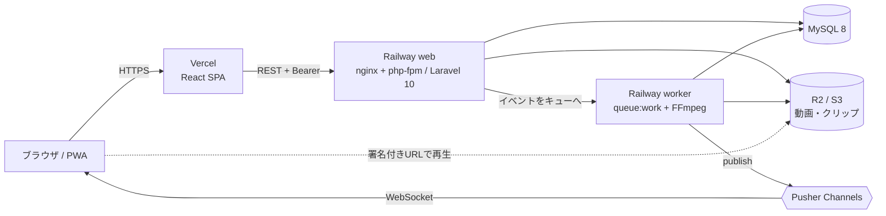

# Spovie 🎬

> Sport + Movie — チームの「見る目」を揃える、スポーツ動画アノテーションツール

スポーツの試合映像（YouTube またはアップロードした mp4）の上に、ペン・矢印・テキストで直接書き込み、ループ区間とコメントを添えて、共有リンクやチームでメンバーに届ける Web アプリです。コメントや新しいアノテーションは、同じ画面を見ている全員にリアルタイムで反映されます。ホーム画面に追加して、PWA としても使えます。

| 項目 | 内容 |
|---|---|
| 公開サイト | **（デプロイ後に記入）** `https://<vercel-domain>` ・ API: `https://<railway-domain>/api/health` |
| GitHub | https://github.com/KakutaSho28/spovie |
| デモアカウント | `demo1@spovie.example` / `demo2@spovie.example`、パスワード `spovie-demo-1234`（2人とも「デモチーム」のメンバー。2つのブラウザで同時に開くとリアルタイム更新を確認できます）※公開デモ用の値。シード実行時（`SEED_DEMO=true`）のみ存在します |
| 設計書 | [docs/](docs/README.md)（要件定義・基本設計・詳細設計・API 仕様・環境構築・自己評価） |

---

## 主な機能

| 機能 | 内容 |
|---|---|
| 動画 | YouTube URL の登録 / mp4 のアップロード（最大 200MB）/ 一覧（20 件ずつのページ送り）/ 削除 |
| アノテーション | ペン・矢印・テキスト・元に戻す・選択削除。ループ区間を指定して保存。**画面サイズが違っても同じ相対位置で再現** |
| 共有 | 有効期限つきの共有リンク。ログイン不要で閲覧できる（YouTube / アップロード動画の両方） |
| 切り抜き | アップロード動画のみ。FFmpeg で非同期に切り抜き、推測できないダウンロード URL を発行（LINE 共有ボタン付き） |
| チーム | 作成、招待 URL で参加、メンバー削除・脱退、チーム動画の共有（メンバーだけが閲覧可能） |
| コメント | アノテーションごとのスレッド。**Pusher でリアルタイムに反映**（接続状態バッジ付き） |
| PWA | ホーム画面に追加、オフラインでもアプリが起動、表示済みの一覧はキャッシュから表示 |

> **著作権ポリシー**: YouTube 動画は「アノテーション + 共有リンク」のみ（切り抜き・動画データの保存はしない）。切り抜きとダウンロードはアップロード動画だけが対象です。

## アーキテクチャ



詳細は [docs/02-basic-design.md](docs/02-basic-design.md)。

## 技術スタック

| レイヤー | 技術 |
|---|---|
| フロントエンド | React 18 / TypeScript (strict) / Vite / Fabric.js v6 / Zustand / Axios / Laravel Echo + pusher-js / vite-plugin-pwa (Workbox) |
| バックエンド | Laravel 10 / PHP 8.2 / Sanctum（Bearer トークン）/ Queue（database）/ FFmpeg / Pusher |
| DB・ストレージ | MySQL 8.0 / S3 互換（Cloudflare R2 または AWS S3）、ローカルは public ディスク |
| テスト | PHPUnit（sqlite in-memory）/ Playwright |
| インフラ・CI | Docker / GitHub Actions / Railway（API・worker・MySQL）/ Vercel（SPA） |

構成の考え方: Controller は「認可 → Service 呼び出し → Resource」だけにし、業務ロジックは `app/Services` に置く（[CLAUDE.md](CLAUDE.md)）。

## ローカルで動かす

必要なもの: Docker Desktop、Git。

```bash
git clone https://github.com/KakutaSho28/spovie.git && cd spovie
cp .env.example .env
docker compose up -d --build
bash scripts/setup-backend.sh        # 初回のみ: composer install / .env / key / migrate / storage:link
docker compose exec php php artisan db:seed   # 任意: デモデータ（上のデモアカウント）
```

| サービス | URL |
|---|---|
| アプリ（nginx 経由） | http://localhost |
| Vite 開発サーバー | http://localhost:5173 |
| API | http://localhost/api（ヘルスチェック: `/api/health`） |

リアルタイムを試すには、Pusher の App を作り、`backend/.env`（`BROADCAST_DRIVER=pusher` と `PUSHER_*`）と root の `.env`（`VITE_PUSHER_APP_KEY` / `VITE_PUSHER_APP_CLUSTER`）を設定します（未設定でもアプリは動作し、バッジは表示されません）。詳しくは [docs/04-setup.md](docs/04-setup.md)。

## テスト

```bash
cd backend && php artisan test      # PHPUnit（sqlite in-memory）。API 仕様書とのずれも検知する
cd frontend && npm ci && npx playwright install chromium
cd frontend && npm run build        # TypeScript strict チェック + ビルド
cd frontend && npm run e2e          # Playwright（API・Pusher はモック。PWA は本番ビルドを配信して検証）
```

PR ごとに GitHub Actions がバックエンドのテスト・フロントのビルド・E2E を実行します（[.github/workflows/ci.yml](.github/workflows/ci.yml)）。

## デプロイ

`main` への push で Railway（API・worker）と Vercel（SPA）が自動デプロイされます。ダッシュボードで行う設定手順と環境変数の一覧は **[docs/deployment.md](docs/deployment.md)** にまとめています。デプロイ後の確認は `bash scripts/smoke-test.sh https://<railway-domain>/api https://<vercel-domain>`。

### 環境変数（抜粋。全量と設定先は docs/deployment.md）

| 変数 | 設定先 | 用途 |
|---|---|---|
| `APP_KEY` / `APP_ENV` / `APP_DEBUG` / `APP_URL` / `APP_FRONTEND_URL` | Railway | アプリ基本設定。`APP_DEBUG=false` 必須。`APP_FRONTEND_URL` は共有・招待リンクの URL に使用 |
| `DB_HOST` / `DB_PORT` / `DB_DATABASE` / `DB_USERNAME` / `DB_PASSWORD` | Railway | MySQL（Railway MySQL の変数を参照） |
| `QUEUE_CONNECTION=database` | Railway | 切り抜き・ブロードキャストをキューで処理 |
| `FILESYSTEM_DISK=s3` / `AWS_*` | Railway | 動画・クリップの保存先（R2 は `AWS_ENDPOINT` と `AWS_USE_PATH_STYLE_ENDPOINT=true`） |
| `CORS_ALLOWED_ORIGINS` | Railway | 許可するフロントのオリジン（ワイルドカード不可） |
| `UPLOAD_MAX_MB` | Railway | アップロード上限（既定 200） |
| `BROADCAST_DRIVER=pusher` / `PUSHER_APP_ID` / `PUSHER_APP_KEY` / `PUSHER_APP_SECRET` / `PUSHER_APP_CLUSTER` | Railway（web と worker） | リアルタイム配信 |
| `SEED_DEMO=true` | Railway | 起動時にデモデータを投入（冪等） |
| `VITE_API_BASE_URL` | Vercel | API のベース URL（`https://<railway-domain>/api`） |
| `VITE_PUSHER_APP_KEY` / `VITE_PUSHER_APP_CLUSTER` | Vercel | リアルタイム接続（ビルド時に埋め込まれる） |
| `VITE_MAX_UPLOAD_MB` | Vercel | UI のアップロード上限表示 |

## ディレクトリ構成

```
spovie/
├── backend/                 # Laravel 10
│   ├── app/Http/Controllers/    # 受信 → 認可 → Service → Resource（薄く保つ）
│   ├── app/Services/            # 業務ロジック（Auth / Video / Annotation / Team / Clip / …）
│   ├── app/Policies/            # 認可
│   ├── app/Events/              # ブロードキャストイベント
│   ├── database/{migrations,factories,seeders}/
│   ├── docs/api-examples.php    # API 仕様書の説明・例（docs/api-endpoints.md の元）
│   ├── Dockerfile               # 本番イメージ（nginx + php-fpm + ffmpeg）
│   └── tests/Feature/
├── frontend/                # React + Vite + TypeScript（PWA）
│   ├── src/{pages,components,hooks,lib,store,api}/
│   └── e2e/                     # Playwright
├── docs/                    # 設計書・仕様書・デプロイ手順
├── docker/ docker-compose.yml   # ローカル開発環境
├── scripts/                 # setup-backend.sh / smoke-test.sh
└── .github/workflows/ci.yml
```

## ブランチ運用

`main`（本番。push でデプロイ）← `develop`（統合）← `feature/*`・`fix/*`・`docs/*`。機能ごとにブランチを切り、PR で CI（テスト・ビルド・E2E）が通ってから `develop` にマージします。コミットメッセージと PR は日本語（Conventional Commits）。

## ライセンス

Private — All rights reserved.
