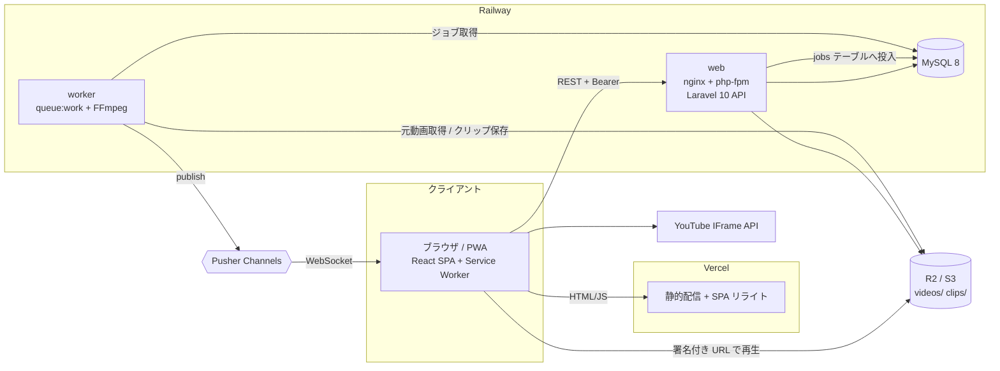
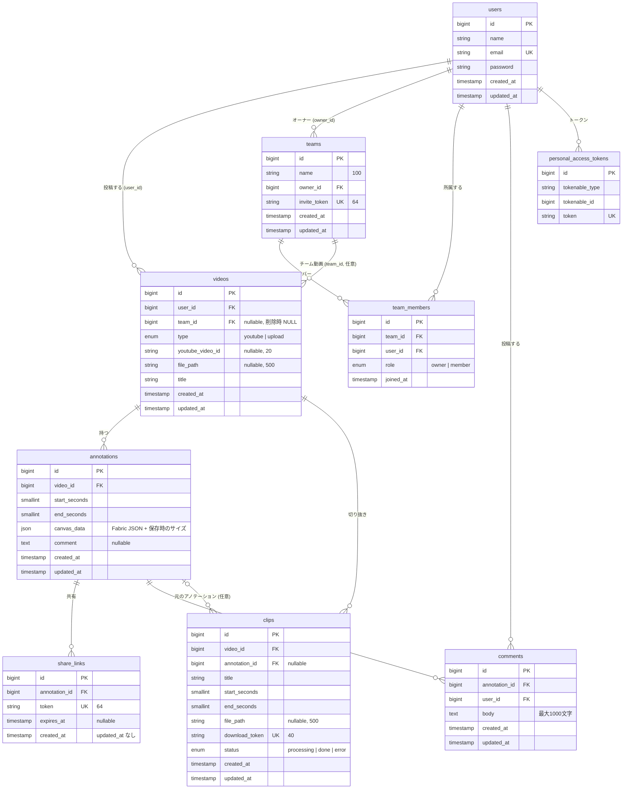
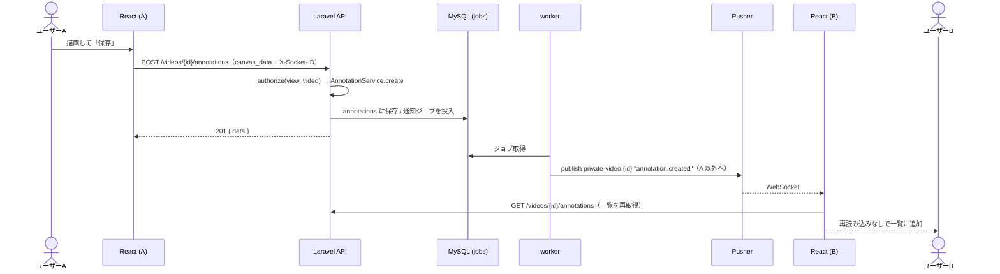
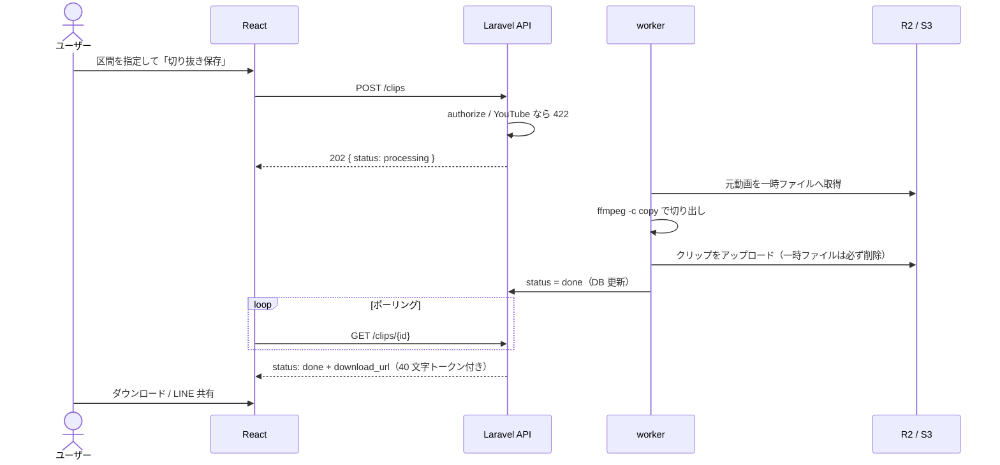

# 基本設計

## 1. システム構成

| コンポーネント | 役割 |
|---|---|
| React SPA（Vercel） | 画面、Fabric.js によるアノテーション描画、YouTube IFrame / HTML5 video、Service Worker |
| Laravel API（Railway web） | REST API、認可、チャンネル認証、イベント発行（キュー投入）。起動時に migrate |
| worker（Railway） | キューの処理: 切り抜き（FFmpeg）、WebSocket 通知の送信 |
| MySQL | 業務データ、ジョブキュー（`jobs`）、トークン |
| R2 / S3 | アップロード動画とクリップ。署名付き URL（既定 60 分）で配信 |
| Pusher Channels | リアルタイム通知（private チャンネル） |

### 設計方針

- **層の分離**: FormRequest（検証のみ）→ Policy（認可のみ）→ Controller（受信・認可・Service 呼び出し・Resource）→ Service（業務ロジック・トランザクション）→ Resource（JSON 整形の唯一の場所）。Repository パターンは導入せず、再利用するクエリは Eloquent のスコープ（例: `Video::visibleTo`）にする。
- **YouTube は座標だけ保存**: 動画データは保存しない（著作権ポリシー）。
- **描画は保存時サイズ基準**: Fabric.js の座標と保存時のキャンバスサイズを保存し、表示時は「現在サイズ ÷ 保存時サイズ」で拡大縮小する。
- **ストレージの差を `MediaStorageService` に閉じ込める**: ローカルは public ディスク、本番は S3 互換 + 署名付き URL。
- **通知は小さく**: Pusher の上限（約 10KB）のため、`canvas_data` は通知に含めず、クライアントが再取得する。

## 2. 機能一覧

要件 ID は [01-requirements.md](01-requirements.md) と対応。

| 機能 | 主な API | 主な画面 |
|---|---|---|
| F01 認証 | `POST /auth/register` `POST /auth/login` `POST /auth/logout` | S01 ログイン、S02 登録 |
| F02 YouTube 動画 | `GET/POST /videos` `GET/DELETE /videos/{video}` | S03 動画一覧、S04 動画追加 |
| F03 アップロード | `POST /videos/upload` | S04 |
| F04〜F06 アノテーション | `GET/POST /videos/{video}/annotations` `DELETE /annotations/{annotation}` | S05 一覧、S06 作成・編集 |
| F07 共有 | `POST /annotations/{annotation}/share` `GET /share/{token}` | S06、S07 共有ページ |
| F08 切り抜き | `POST /clips` `GET /clips/{clip}` `GET /clips/{clip}/download/{token}` | S06（モーダル）、S08 切り抜き状態 |
| F17 チーム | `/teams`、`POST /teams/join`、`DELETE /teams/{team}/members/{user}`、`GET /teams/{team}/videos` | S09〜S12 |
| F18 コメント | `GET/POST /annotations/{annotation}/comments` `DELETE /comments/{comment}`、WebSocket | S05、S06 |
| F19 PWA | （Service Worker） | 全画面 |

## 3. ER 図

補足:
- 外部キーは、親の削除で子も削除（`cascade`）。例外: `videos.team_id` と `clips.annotation_id` は親の削除で NULL（チームを削除しても動画は投稿者の個人動画に戻る）。
- `team_members` は `(team_id, user_id)` が一意。オーナーも `role = owner` のメンバーとして 1 行持つ。
- ジョブキュー（`jobs`、`failed_jobs`）は Laravel 標準のテーブル。
- `videos.type` が `youtube` のとき `youtube_video_id` のみ、`upload` のとき `file_path` のみを使う。

## 4. 権限設計

| 操作 | 個人動画 | チーム動画 |
|---|---|---|
| 閲覧・アノテーション作成/削除・コメント・共有リンク発行・切り抜き | 投稿者 | チームメンバー全員 |
| 動画の削除 | 投稿者 | 投稿者、またはチームオーナー |
| コメントの削除 | コメントの投稿者のみ | 同左 |
| チームの削除 | — | オーナーのみ |
| メンバーを外す | — | オーナー（オーナー自身は不可） |
| 脱退 | — | 本人（オーナーは不可） |
| 共有リンクの閲覧 | 誰でも（トークンを知っていれば）。期限切れは 410 | 同左 |
| クリップのダウンロード | 誰でも（40 文字のトークンを知っていれば） | 同左 |
| WebSocket チャンネルの購読 | 動画を閲覧できる人のみ | 同左 |

実装: `app/Policies`（Video / Annotation / Clip / Comment / Team）。拒否時は共通の 403 `{"message":"この操作は許可されていません"}`。

## 5. 主要フロー

### 5.1 アノテーションの保存とリアルタイム通知

### 5.2 共有リンク

1. 作成者が `POST /annotations/{id}/share` → 64 文字のトークンを発行、`share_url`（フロントの `/share/{token}`）を返す。
2. 受け取った人が `/share/{token}` を開く（ログイン不要）→ `GET /share/{token}` → 区間・描画・動画情報（YouTube は ID、アップロードは署名付き URL）。
3. 画面は動画をループ再生し、描画を現在の表示サイズに合わせて重ねる。期限切れは 410、不明は 404。

### 5.3 切り抜き（アップロード動画のみ）

### 5.4 チーム招待

1. オーナーがチーム詳細で招待 URL（`/teams/join/{64文字のトークン}`）をコピーして共有。
2. 受け取った人が開く。**未ログインならトークンを保存してログイン画面へ**、ログイン後に自動で戻って `POST /teams/join` を実行（冪等）。
3. 参加後はチームの動画が一覧に出る。動画追加時に追加先（個人 / 所属チーム）を選べる。

### 5.5 認証

Sanctum の Bearer トークン。ログイン時に既存トークンをすべて失効して再発行。フロントはトークンを `localStorage` に保持し、401 で自動ログアウト。WebSocket の private チャンネルは `POST /api/broadcasting/auth`（Bearer）で認可する。
