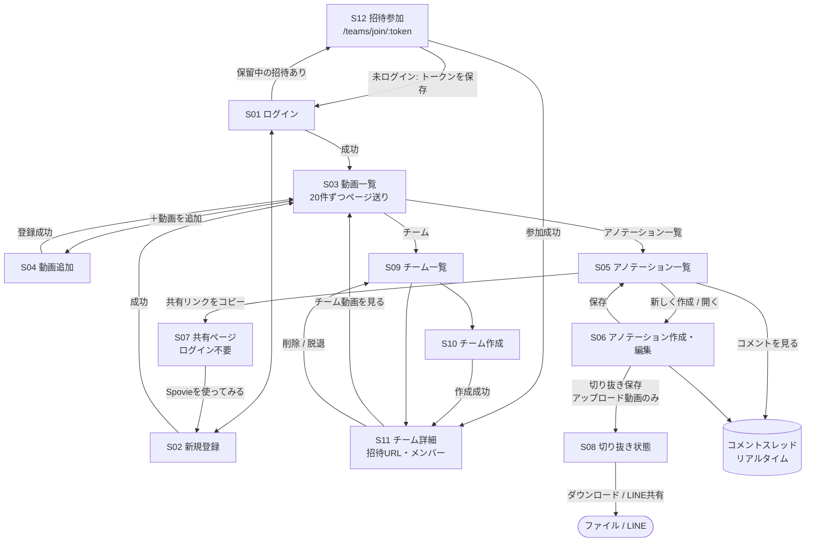

# 詳細設計

API の詳細（全エンドポイントのパス・認証・バリデーション・リクエスト/レスポンス例・リアルタイムイベント）は **[api-endpoints.md](api-endpoints.md)**（自動生成）を参照。

## 1. 画面一覧

| ID | 画面 | パス | 認証 | 主な API |
|---|---|---|---|---|
| S01 | ログイン | `/login` | 不要（ログイン済みなら `/` へ） | `POST /auth/login` |
| S02 | 新規登録 | `/register` | 不要（同上） | `POST /auth/register` |
| S03 | 動画一覧 | `/` | 必要 | `GET /videos`、`GET /teams`、`DELETE /videos/{id}` |
| S04 | 動画追加 | `/videos/new` | 必要 | `POST /videos`、`POST /videos/upload`、`GET /teams` |
| S05 | アノテーション一覧 | `/videos/:videoId/annotations` | 必要 | `GET /videos/{id}/annotations`、`POST /annotations/{id}/share`、`DELETE /annotations/{id}`、コメント API |
| S06 | アノテーション作成・編集 | `/videos/:videoId/annotate`（`?annotationId=` で既存を開く） | 必要 | `GET /videos/{id}`、`POST /videos/{id}/annotations`、`POST /clips`、コメント API |
| S07 | 共有ページ | `/share/:token` | **不要** | `GET /share/{token}` |
| S08 | 切り抜き状態 | `/clips/:clipId` | 必要 | `GET /clips/{id}`（ポーリング） |
| S09 | チーム一覧 | `/teams` | 必要 | `GET /teams` |
| S10 | チーム作成 | `/teams/new` | 必要 | `POST /teams` |
| S11 | チーム詳細 | `/teams/:teamId` | 必要 | `GET /teams/{id}`、`DELETE /teams/{id}/members/{user}`、`DELETE /teams/{id}` |
| S12 | 招待参加 | `/teams/join/:token` | **不要**（未ログインならログイン後に自動参加） | `POST /teams/join` |

共通部品: ヘッダー（動画 / チーム / リアルタイム接続バッジ / ホーム画面に追加 / ログアウト）、オフラインバナー、ページ送り。

## 2. 画面遷移図

## 3. 画面仕様（要点）

### S03 動画一覧
- 表示: サムネイル（YouTube はサムネイル画像、アップロードは `<video>` の先頭）、タイトル、種別、所属（個人 / チーム名）、作成日。
- フィルタ: すべて / 個人 / 各チーム → サーバー側（`scope` / `team_id`）。切り替えると 1 ページ目に戻る。
- ページ送り: 前へ / ページ番号（先頭・末尾・現在の前後、間は省略記号）/ 次へ、「全N件」。現在ページは URL の `?page=`（リロード・共有・戻る/進むに対応）。最後のページの最後の 1 件を削除して範囲外になったら最終ページへ戻る。1 ページ以下なら非表示。
- 取得失敗時: オフラインなら「オフラインのため動画一覧を表示できません」、それ以外はエラー表示。

### S04 動画追加
- タブ: YouTube URL / mp4 アップロード。URL は watch?v= / youtu.be / embed に対応、サムネイルをプレビュー。
- 追加先: 個人 / 所属チーム。アップロードはドラッグ&ドロップ、進捗バー、クライアント側でサイズ（`VITE_MAX_UPLOAD_MB`）と形式を事前チェック。

### S06 アノテーション作成・編集
- 構成: プレーヤー（YouTube IFrame または HTML5 video）+ 透明な Fabric.js キャンバスを重ねる。`ResizeObserver` でキャンバスをプレーヤーに追従。
- ツール: 動画操作 / ペン / 矢印 / テキスト、元に戻す、選択削除、色 3 色。描画ツールに切り替えると動画を一時停止。
- ループ: 開始・終了（`m:ss`）を入力し「ループ再生」。YouTube は 250ms ごとに位置を監視、HTML5 は `timeupdate`。
- 保存: 区間 + 描画 + コメント。保存済み（`?annotationId=`）ならコメントスレッドも表示。アップロード動画のみ「切り抜き保存」。
- オフライン中: 保存ボタンを無効化し、「YouTube の再生と保存には接続が必要」と表示。

### S07 共有ページ
- ログイン不要。YouTube は IFrame、アップロード動画は HTML5 video（ミュートで自動再生、区間をループ）。描画は現在の表示サイズに合わせて再現。有効期限切れ・不明・オフラインはそれぞれ別のメッセージ。

### S11 チーム詳細
- 招待 URL（コピー）、メンバー一覧（オーナー表示）。オーナー: メンバーを「外す」「チームを削除」。メンバー: 「チームを脱退」。

## 4. アノテーションの座標設計

課題: 同じ描画を、保存時と違う画面幅（PC とスマホ、共有ページ）で同じ相対位置に表示する。

- **保存**: Fabric.js の `toJSON()` の `objects`（絶対座標）と、保存時のキャンバスサイズ `canvas_width` / `canvas_height` を `canvas_data` に保存する。
- **復元**: 全オブジェクトの `left` / `top` / `scaleX` / `scaleY` に「現在サイズ ÷ 保存時サイズ」を掛ける（`src/lib/canvasScale.ts`）。ペン（Path）・矢印（Group）・テキストのどれも原点まわりの一様な拡大縮小で正しく再現される。`scaleX` / `scaleY` が無い図形は 1 として扱う。
- **リサイズ**: プレーヤーのサイズが変わったら、既存オブジェクトも同じ比率で拡大縮小する。
- **旧形式**: 初期実装は座標を 0〜1 に正規化して保存していた（`__normalized: true`）。読み込み時に絶対座標へ変換して互換を保つ。
- **検証**: Playwright で、1280px 幅で描画→保存→640px 幅で開き直し、実描画ピクセルの相対位置が 2% 以内で一致することを確認（`frontend/e2e/canvas-roundtrip.spec.ts`）。

## 5. リアルタイム（Pusher Channels）

仕様（チャンネル・イベント・ペイロード）は [api-endpoints.md](api-endpoints.md#リアルタイムイベントpusher-channels) を参照。実装上のポイント:

- 発火は Service 内の `broadcast(new Event)->toOthers()`。イベントは `ShouldBroadcast`（キュー経由）で、**worker が Pusher に送る**。
- フロントは `X-Socket-ID` を全リクエストに付け、操作した本人には通知が返らない。それでもサーバーが本人に送った場合に備え、コメントは **id で重複排除**する。
- 通知の `is_own` は使わず、`user.id` と自分の ID で判定する（閲覧者ごとに値が違うため）。
- 切断→再接続を検知（`connected` 以外になった後に `connected`）したら、一覧を再取得して取りこぼしを補う。
- Pusher のキーが未設定なら Echo を作らず、リアルタイム機能なしで動作する（バッジも非表示）。

## 6. PWA・オフライン

[pwa.md](pwa.md) を参照（キャッシュ戦略・UI・テスト・Lighthouse）。要点: アプリシェルはプリキャッシュ、`GET /api/*` は NetworkFirst（最大 5 分）、**動画・クリップ・WebSocket 認証は絶対にキャッシュしない**、API キャッシュはログイン/ログアウトで破棄。

## 7. エラー処理

| 状況 | バックエンド | フロントエンド |
|---|---|---|
| 未認証 | 401 | トークンを破棄してログインへ |
| 権限なし | 403 `{"message":"この操作は許可されていません"}`（Policy / `ServiceException` を Handler が変換） | 画面ごとにメッセージ表示 |
| 入力不正 | 422 `{message, errors}` | フォームにメッセージ表示 |
| 業務ルール違反 | `ServiceException(message, status)` | メッセージ表示 |
| 切り抜き失敗 | `status = error`（一時ファイルは必ず削除） | 状態画面にエラー表示 |
| オフライン | — | バナー + 操作の無効化 + キャッシュ表示 / オフライン案内 |

## 8. テスト戦略

| 層 | 内容 | 件数・方法 |
|---|---|---|
| Service | 業務ルール、冪等性（参加）、著作権ポリシー（YouTube は切り抜き不可）、ストレージ分岐 | PHPUnit |
| API（認可） | 全エンドポイントを オーナー / メンバー / 非メンバー / 未認証 で検証 | PHPUnit（sqlite in-memory） |
| API 仕様 | ルートと説明の過不足、生成物の最新性、**実レスポンスと例の構造一致** | PHPUnit |
| リアルタイム | イベント発火・チャンネル・ペイロード、チャンネル認可（ダミーキー） | PHPUnit |
| E2E | 描画の復元、招待フロー、ページ送り、リアルタイム（偽 Pusher サーバー）、PWA（本番ビルド + 実 HTTP モック API） | Playwright |
| CI | PR ごとにバックエンドテスト・フロントのビルド・E2E | GitHub Actions |
