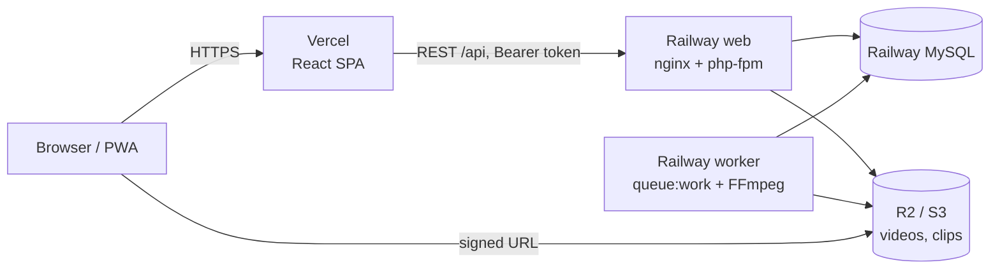

# デプロイ手順（Railway + Vercel + S3互換ストレージ）



- `main` への push で Railway / Vercel が自動デプロイされる。
- コンテナは起動時に `php artisan migrate --force` → `config:cache` → `route:cache` を実行する。
- 動作確認済み（ローカルの Docker で本番イメージをビルドし MySQL と接続して起動）: `/api/health` 200、`scripts/smoke-test.sh` 全項目成功、FFmpeg 7.1 同梱、215MB アップロードは nginx が 413 で拒否。
  **未確認（実環境が必要）**: Railway 上での起動、R2/S3 への実接続（署名URL・アップロード・クリップ生成）、Vercel のデプロイ。

---

## Manual steps for the human

ダッシュボード操作が必要な作業です。上から順に実施してください。

### 0. 事前: `main` に反映
`develop` → `main` の PR をマージする（`backend/Dockerfile` などが `main` に必要）。

### 1. オブジェクトストレージ（Cloudflare R2 を推奨 / AWS S3 でも可）

**Cloudflare R2**
1. Cloudflare ダッシュボード → R2 → バケット作成（例: `spovie-media`、公開設定は **オフ**）
2. R2 → API トークンを管理 → 「Object Read & Write」権限、対象バケット限定で作成
3. 控える値: Access Key ID / Secret Access Key / Account ID
4. 設定値: `AWS_ENDPOINT=https://<ACCOUNT_ID>.r2.cloudflarestorage.com`, `AWS_DEFAULT_REGION=auto`, `AWS_USE_PATH_STYLE_ENDPOINT=true`

**AWS S3 の場合**: プライベートバケットを作成し、`s3:GetObject/PutObject/DeleteObject/ListBucket` のみを許可した IAM ユーザーのキーを発行。`AWS_DEFAULT_REGION=ap-northeast-1`（バケットのリージョン）、`AWS_ENDPOINT` は空、`AWS_USE_PATH_STYLE_ENDPOINT=false`。

### 2. Railway（バックエンド）
1. New Project → Deploy from GitHub repo → `KakutaSho28/spovie`
2. **web サービス**
   - Settings → Source → **Root Directory = `backend`**
   - Settings → Config-as-code → **Config Path = `/backend/railway.json`**
   - Settings → Networking → **Generate Domain**（例: `spovie-api.up.railway.app`）。これが API のベース URL
3. **MySQL**: New → Database → MySQL を同じプロジェクトに追加（サービス名は `MySQL` のままにする）
4. **worker サービス**: New → GitHub Repo（同じリポジトリ）
   - Root Directory = `backend`、Config Path = **`/backend/railway.worker.json`**（Start Command = `php artisan queue:work --tries=1 --timeout=600`）
   - 公開ドメインは **作らない**
5. 環境変数（下表）を web に設定し、worker にも同じ値を設定する（Railway の Shared Variables が便利）
6. デプロイ後、`https://<railway-domain>/api/health` が `{"data":{"status":"ok","database":"ok"}}` を返すことを確認

### 3. Vercel（フロントエンド）
1. Add New → Project → 同じ GitHub リポジトリを Import
2. **Root Directory = `frontend`**、Framework Preset = Vite（`frontend/vercel.json` で SPA リライト設定済み）
3. 環境変数（下表）を設定 → Deploy
4. 発行された URL（例: `https://spovie.vercel.app`）を Railway の `APP_FRONTEND_URL` / `CORS_ALLOWED_ORIGINS` に設定し、Railway を再デプロイ

### 4. 動作確認
```bash
bash scripts/smoke-test.sh https://<railway-domain>/api https://<vercel-domain>
```
その後ブラウザで: 登録 → YouTube 動画追加 → 描画して保存 → 共有リンクをシークレットウィンドウで開く → mp4 をアップロード → 切り抜き → ダウンロード（← R2/S3 の実接続確認）。

### 5. 任意
- GitHub: `main` / `develop` にブランチ保護（CI 必須）
- Vercel のプレビュー URL からも API を使う場合は `CORS_ALLOWED_ORIGINS_PATTERNS=#^https://spovie-.*\.vercel\.app$#`

---

## 環境変数

### Railway（web / worker 共通。`PORT` は Railway が自動設定）

| 変数 | 値 | 備考 |
|---|---|---|
| `APP_NAME` | `Spovie` | |
| `APP_ENV` | `production` | |
| `APP_DEBUG` | `false` | **必須**（Laravel 10 系の既知のデバッグ画面 XSS 対策） |
| `APP_KEY` | `base64:...` | ローカルで `cd backend && php artisan key:generate --show` を実行して生成 |
| `APP_URL` | `https://<railway-domain>` | |
| `APP_FRONTEND_URL` | `https://<vercel-domain>` | 共有リンク・招待リンクの URL に使用 |
| `LOG_CHANNEL` | `stderr` | Railway のログに出す |
| `DB_CONNECTION` | `mysql` | |
| `DB_HOST` | `${{MySQL.MYSQLHOST}}` | Railway の変数参照 |
| `DB_PORT` | `${{MySQL.MYSQLPORT}}` | |
| `DB_DATABASE` | `${{MySQL.MYSQLDATABASE}}` | |
| `DB_USERNAME` | `${{MySQL.MYSQLUSER}}` | |
| `DB_PASSWORD` | `${{MySQL.MYSQLPASSWORD}}` | |
| `QUEUE_CONNECTION` | `database` | |
| `FILESYSTEM_DISK` | `s3` | |
| `AWS_ACCESS_KEY_ID` | R2/S3 のキー | |
| `AWS_SECRET_ACCESS_KEY` | R2/S3 のシークレット | |
| `AWS_DEFAULT_REGION` | `auto`（R2）/ `ap-northeast-1`（S3） | |
| `AWS_BUCKET` | バケット名 | |
| `AWS_ENDPOINT` | R2 のみ: `https://<ACCOUNT_ID>.r2.cloudflarestorage.com` | |
| `AWS_USE_PATH_STYLE_ENDPOINT` | R2: `true` / S3: `false` | |
| `CORS_ALLOWED_ORIGINS` | `https://<vercel-domain>` | カンマ区切り。ワイルドカード不可 |
| `CORS_ALLOWED_ORIGINS_PATTERNS` | （任意）正規表現 | Vercel プレビュー用 |
| `SANCTUM_STATEFUL_DOMAINS` | `<vercel-domain>`（ホスト名のみ） | Bearer トークン認証のため実質未使用だが設定しておく |
| `UPLOAD_MAX_MB` | `200` | 既定値。変更時は `backend/docker/{php.ini,nginx.conf.template}` も更新 |
| `MEDIA_URL_TTL_MINUTES` | `60` | 署名付きURLの有効期限 |
| `MEDIA_TEMPORARY_URLS` | （空） | s3 では自動的に署名URL。公開バケット運用なら `false` |

WP5（Pusher）で追加予定: `BROADCAST_DRIVER=pusher`, `PUSHER_APP_ID`, `PUSHER_APP_KEY`, `PUSHER_APP_SECRET`, `PUSHER_APP_CLUSTER`。

### Vercel

| 変数 | 値 |
|---|---|
| `VITE_API_BASE_URL` | `https://<railway-domain>/api` |
| `VITE_MAX_UPLOAD_MB` | `200`（バックエンドの `UPLOAD_MAX_MB` と同じ値） |

---

## 運用メモ

- **マイグレーション**は web サービス起動時に自動実行される。失敗するとデプロイは失敗扱いになり、旧バージョンが維持される。
- **アップロード上限 200MB** の理由: 本番のプロキシ/リクエストタイムアウト内に収めるため（前提は将来の presigned 直接アップロードで解消可能）。
- **イメージサイズ**は約 1GB（FFmpeg 同梱）。初回ビルドに数分かかる。
- **ロールバック**: Railway の Deployments から以前のデプロイを Redeploy、Vercel は Promote to Production。
- Laravel 10 系は修正版が出ない既知の脆弱性が 4 件ある（`composer audit`）。アプリはメール送信・Laravel署名付きURLを使わず、`APP_DEBUG=false` で運用する。恒久対応は Laravel 12 以降へのアップグレード。
